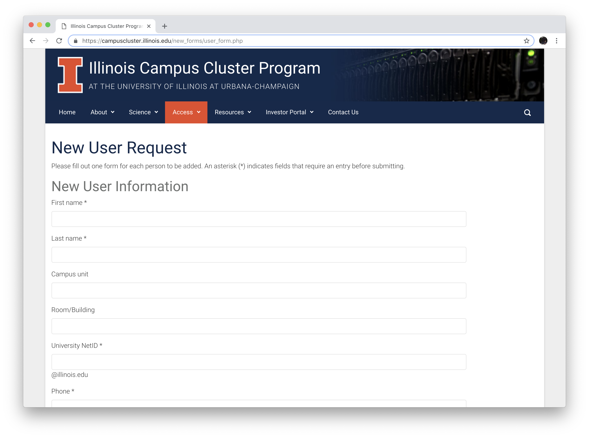
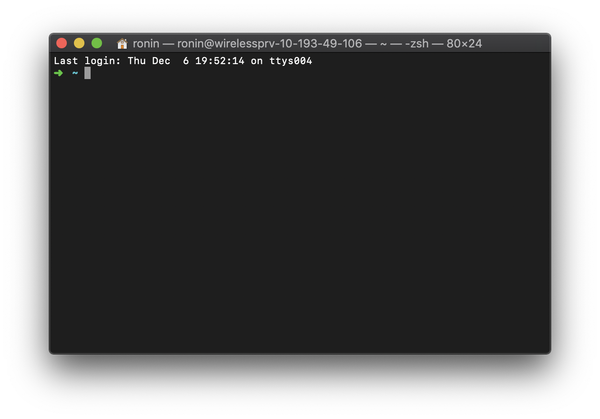
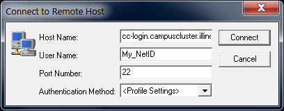

```{r setup, include=FALSE}
options(width = 60)
knitr::opts_chunk$set(echo = TRUE, cache = TRUE)
```

### On the Agenda   

\begin{multicols}{2}
\tableofcontents[]
\end{multicols}

# Cluster Computing

## Motivation

### Goals of the Talks

#### Talk 1: Overview of Cluster Computing

- Become Knowledgeable about ICC
- Connect into ICC
- Use Software

#### Talk 2: Overview of Scheduling Jobs

- Downloading and Uploading Data
- Writing a PBS Files
- Submitting and Checking Jobs

### Overall Goal

```{r awesome-hpc, out.width = "150px", fig.retina = NULL, fig.align='center', fig.cap="Yubai taking a break from working with ICC", cache = TRUE, echo = FALSE}

```

## Background

### What is Cluster Computing?

#### Definition: Cluster

A **cluster** is a _set of computers_ that are connected together and share 
resources as if they were one gigantic computer.

```{r rpi_cluster, out.width = "175px", fig.retina = NULL, fig.align='center', cache = TRUE, echo = FALSE}
knitr::include_graphics("img/rpicluster.jpg")
```

### How Does Cluster Computing WorK?

#### Definition: Parallel Processing

- **Parallel Processing** is the act of carrying out multiple tasks simultaneously to solve a problem. 
- This is accomplished by dividing the problem into independent subparts,
which are then solved concurrently.

```{r parallel_processing, out.width = "175px", fig.retina = NULL, fig.align='center', cache = TRUE, echo = FALSE}
knitr::include_graphics("img/parallel_processing.png")
```

### Parallelization Realized

#### Definition: Jobs

- **Jobs** denote the independent subparts.

```{r parallel4n, out.width = "300px", fig.retina = NULL, fig.align='center', cache = TRUE, echo = FALSE}
knitr::include_graphics("img/parallel_job_diag_4n.png")
```


### Why Should we use Cluster Computing?

#### Pros

- Speeds up simulations by allowing iterations to be run simultaneously.
- Provides more resources for computations.
    - e.g. CPU Cores, RAM, Hard Drive Space, and Graphics Cards (GPUs).
- Nightly snapshots/backups of files.
- Extends the lifespan of your computer.

#### Cons

- Simulations are **not** instantly run.
    - Need to "queue" for resources.
- Higher barrier of entry due to knowledge requirements.
- Poorly handles opening and closing data sets.
- Adding or updating software is complex.

### Overview of Resources

#### Clusters at UIUC

- [**Illinois Campus Cluster (ICC)**](http://campuscluster.illinois.edu)
    - Follows a time share model with a majority of departments buying in and is
  also usable for classes. _Try to use this option first_.
- [**Keeling**](https://wiki.cites.uiuc.edu/wiki/display/manabecluster/keeling+Home) 
  (formerly **manabe**)
    - LAS machine for faculty & graduate students. 
      Provides a stepping stone environment to ICC usage.
- [**Biocluster**](http://biocluster.igb.illinois.edu/)
    - Open to a majority of departments with preference to biology fields under
      a Research Computing as a Service (RCaaS) paradigm.
- [**BlueWaters**](https://bluewaters.ncsa.illinois.edu/)
    - Expensive, but [grants](https://bluewaters.ncsa.illinois.edu/education-allocations)
  can be had if faculty are affiliated with NCSA. Requires two-factor authentication.

# Getting Started with ICC

## Background

### What is ICC?

#### Fast Facts

- [Illinois Campus Cluster (ICC)](campuscluster.illinois.edu/) is the public
  facing name to the underlying node arrangement called: Golub (deployed 2013).
- The cluster has over **300+ computing nodes** available for use.
- These nodes are managed by [Torque Resource Manager](http://www.adaptivecomputing.com/products/open-source/torque/), a form of OpenPBS,
  with the [Moab Workload Manager](http://www.adaptivecomputing.com/products/hpc-products/moab-hpc-basic-edition/).

#### Time-Share Model

Management of nodes relate to two forms of queues for job submission:

- **Primary:** Settings specific to the investor.
- **Secondary:** Shared resource queue that allows access to any 
     idle nodes in the cluster under specific limits (see queue slide).

## Request Access

### Requesting an Account for ICC

Fill out the access request form.

**<https://campuscluster.illinois.edu/new_forms/user_form.php>**

```{r request-access, out.width = "200px", fig.retina = NULL, fig.align='center', cache = TRUE, echo = FALSE}

```

## Connecting to ICC

### Talking to a Cluster

#### Definition: CLI

**Command Line Interfaces (CLI)** encourages interactions with a computer via user issued text-commands.

#### Terminal

- macOS and Linux have built in "shells" or "terminal" applications. 

```{r terminal, out.width = "175px", fig.retina = NULL, fig.align='center', cache = TRUE, echo = FALSE}

```

### Windows-Specific options

#### PuTTY

- If on Windows, then **[download and install PuTTY](http://www.chiark.greenend.org.uk/~sgtatham/putty/)** 
- Setup a connection portal with: 

```{r connect-to, out.width = "175px", fig.retina = NULL, fig.align='center', cache = TRUE, echo = FALSE}

```

#### Windows Subsystem Linux (WSL)

- Run a Linux terminal directly under a Windows 10 PC.
- Follow the **[Installation guide](https://docs.microsoft.com/en-us/windows/wsl/install-win10)**

### Accessing ICC via CLI

#### Example login

We first need to establish a connection to ICC to work on it. 
We can do this using **Secure Shell**, more commonly known as: `ssh`

```{bash, eval = F}
ssh netid@cc-login.campuscluster.illinois.edu
# Enter password
```

#### How I would login...

```{bash, eval = F}
ssh balamut2@cc-login.campuscluster.illinois.edu
# nottelling 
```

# ICC Structure

## Overview

### Structure of ICC^[Mirrors the academic model of professors distributing ideas to graduate students, waiting for them to solve
the ideas, then aggregating the results into a paper. c.f. [The Simpson S18E6 - Moe'N'A Lisa](https://www.youtube.com/watch?v=-fM8ao0iXRE#t=12s).]

```{r cc_diagram, out.width = "250px", fig.retina = NULL, fig.align='center', cache = TRUE, echo = FALSE}
knitr::include_graphics("img/cc-diagram.png")
```

### Queue Details^[The _newest_ 4 nodes are on order and should arrive soon (tm).]

| Queue           |  Max Walltime  |  Max # of Nodes |
|:----------------|:--------------:|:---------------:|
| **test**        |    5 minutes   |       2         |
| **secondary**   |    4 hours     |       208       |
| **stat**        |  336 hours     |       2         |

The `stat` queue has **14 nodes (~368 cores available)** structured as:

- 4: each with 128GB of memory & 16 cores (oldest)
- 4: each with 256GB of memory & 24 cores (older).
- 2: each with 256GB of memory, 24 cores, & 2 NVIDIA Tesla K80 GPUs (newer).
- 2: each with 384GB of memory & 40 cores (newest)
- 2: each with 384GB of memory, 40 cores, & 2 NVIDIA Tesla P100 16GB GPUs (newest)

## Storage

### Storing Data & Code

#### Possible locations...

- Home Directory `~/`
    - Up to **~2GB** (Soft cap^[Soft caps gently warn the user to lower their storage size.])
      / **~4GB** (Hard cap^[Hard caps prevent the user from adding new files.]) with **nightly backups**.
    - Storage is **private**.
- Project Spaces `/projects/stat/shared/$USER`
    - **~21TB** of shared space with **nightly backups**.
    - Storage is **shared** among `stat` members.
- Temporary Networked Storage `/scratch`
    - **~10TB** of space purged after **30 days** with **no backup**.
    - Storage is **shared** among **all** ICC community members.
    
### Backups

#### Backup Info

- **Daily** night time backups.
- **30 days** of backups exist. 
- **No off-site backups for disaster recovery.**

#### Location of Backups

- Home Directory `~/`

```bash
/gpfs/iccp/home/.snapshots/home_YYYYMMDD*/$USER
```

- Project Directory `/projects/stat/shared/$USER`

```bash
/gpfs/iccp/projects/stat/.snapshots/statistics_YYYYMMDD*
```

## Software Modules on ICC 

### Software Modules

#### Module Files

Unlike a traditional desktop, you must load the different software that you
wish to use into the environment via `modulefiles`. The list of
supported software can be found on [Software List](https://campuscluster.illinois.edu/resources/software/)
or by typing:

```bash
module avail
```

#### Viewing, Retrieving, and Disabling Module Software

```bash
module list              # See active software modules
module load <software>   # Enable software
module unload <software> # Disable software
module purge             # Removes all active modules
```

### Working with Software

#### Latest Version of _R_

As of **November 2018**, the latest version of _R_ on ICC is 
_R_ **3.5.1**. _R_ can be accessed by using^[
If the version is not specified during the load, e.g. `module load R`, then
the oldest version of _R_ will be used.]: 

```bash
module load R/3.5.1 # Load software
```

#### Ask for Help

ICC's help desk (via <help@campuscluster.illinois.edu>)
can help install software on ICC. Please send them an e-mail and _CC_ your advisor.

#### Writing a Custom Module

It is possible to compile and create your own modules.
For details, see the tutorial [A Modulefile Approach to Compiling _R_ on a Cluster](http://thecoatlessprofessor.com/programming/a-modulefile-approach-to-compiling-r-on-a-cluster/).

### Setup R Package library^[This takes advantage of the `stat` project space (~21TB) instead of the home directory (~2gb) limit.] and Temporarily use *R* on ICC^[Always load *R* via `module load`. Otherwise, *R* will **not** be available.]

```{bash, eval = F}
# Create a directory for your R packages 
mkdir ~/project-stat/rlibs

# Load R version 3.5.1
module load R/3.5.1

# Set the R library environment variable (R_LIBS) to
# include your R package directory   
export R_LIBS=~/project-stat/rlibs

# See the path
echo $R_LIBS
```

### Permanently setup *R* home library

To ensure that the `R_LIBS` variable remains set even after logging out
run the following command to permanently add it to the environment.^[The routine modifies the `.bashrc` file, which is loaded on startup.]

```{bash, eval = F}
cat <<EOF >> ~/.bashrc
  if [ -n $R_LIBS ]; then
      export R_LIBS=~/project-stat/rlibs:$R_LIBS
  else
      export R_LIBS=~/project-stat/rlibs
  fi
EOF
```

### Install *R* packages into home library

```{bash, eval = F}
# Use the install.packages function to install your R package.  
$ Rscript -e "install.packages('devtools',
              '~/Rlibs', 'http://ftp.ussg.iu.edu/CRAN/')"

# Use devtools to install package
$ Rscript -e "devtools::install_github('coatless/visualize')"

# Devtools install from secret repo
$ Rscript -e "devtools::install_github('stat385/netid',
                                       subdir='secretpkg',
                                       auth_token = 'abc')"
```

- Watch the use of `'` and `"`! 
- For `auth_token` obtain a **[GitHub Personal Access Token](https://help.github.com/articles/creating-an-access-token-for-command-line-use/)**

### 

\centering
\Huge
Thanks! Robin's up next...

# Appendix

## SSH Tricks (Keys & Aliases)

### Speeding Up Access

Repetitively typing out login credentials is tedious:

```bash
ssh netid@cc-login.campuscluster.illinois.edu
# password 
```

There are two tricks that void this and also make locally
launched script jobs possible.

- Public/Private keys
    - Passwordless login
- SSH Config
    - Alias connection names

### Public/Private Keys

#### Authentication with Keys

Instead of entering a password, the local computer can submit a private key to be
verified by a server. This is a bit more secure and avoids the hassle of constantly
typing passwords.

#### Generating an SSH Key

\scriptsize

```bash
## Run:
ssh-keygen -t rsa -C "netid@illinois.edu"

## Respond to:
# Enter file in which to save the key (/home/demo/.ssh/id_rsa): # [Press enter]
# Enter passphrase (empty for no passphrase): # Write short password
```

\normalsize

#### Copy SSH Key to Server

```bash
## Run:
ssh-copy-id netid@cc-login.campuscluster.illinois.edu
```

### SSH Config^[**Note:** This assumes a default location is used for the SSH key. If there is a custom SSH key location add `IdentityFile ~/.ssh/sshkeyname.key` after the `User` line.]

#### Setting up a Configuration

Add the following to `~/.ssh/config`^[**Replace** `netid` with your netid.]

```bash
Host icc
    HostName cc-login.campuscluster.illinois.edu
    User netid
```

## Acknowledgements

### Acknowledgements

- Special thanks to the ICC team for putting together a great [user guide](https://campuscluster.illinois.edu/resources/docs/user-guide/).

